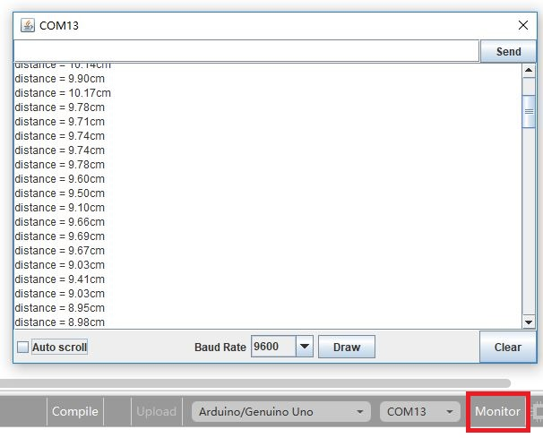
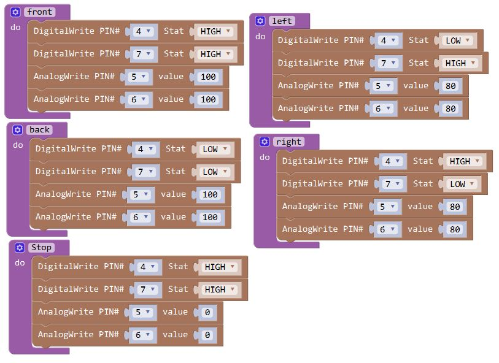

# **KS0353 Keyestudio KEYBOT Coding Education Robot**

## 1. Overview

In the near future, many things might no longer be done by ourselves because the robots are able to help us do many things. So what does the future robot look like? What can it do?

He may be controlled by human voice. Do not use the remote control. Just press the power button and the robot will start do something you said and never get tired.

In addition to cooking, there may be another magical feature. In the summer, the weather is very hot. At this time, you definitely want to drink a glass of juice. As long as you give orders, the robot will pick up the fruit and put it in his body. After a while, there will be juice to drink, and he can freeze the juice. The taste is more delicious. Robots also have a lot of magical features that allow you to enjoy a simple, fast lifestyle, and the future robots will become more excellent.

Now, let’s DIY the KEYBOT robot. The KEYBOT robot is based on easy-to-use and flexible open-source Arduino platform. KEYBOT control board comes with the RJ11 plug, so it is very easy to connect other sensor modules with only one cable.

The robot is designed in metal structure, solid and durable. The assembly is really simple, believing you can install well the KEYBOT within 30mins.

As for the KEYBOT coding, you will learn how to get started with Arduino programming C language and Mixly block platform. Even the beginner with no coding experience can easily understand the graphical program. Take your brain on an inspiring journey through the world of programming. Get started now!

## 2. Parameters

- External power supply range: 7-12V

- Current Range: min 800mA

- Motor Speed: 6.0V 100rpm/min

- Motor control is driven by TB6612

- Three groups of line tracking modules, to detect black-white line with higher accuracy and can be used for anti-fall control as well.

- Ultrasonic module is used to detect the obstacle distance, avoiding the front obstacle when the distance detected is less than a certain value.

- Bluetooth wireless module can be paired with Bluetooth device on mobile phone to remotely control the KEYBOT. Turn off the Bluetooth when programming.

- The shield has two servo interfaces.

- It can access the external voltage 7\~12V.

## 3. List

You can see a pretty beautiful packaging box for the KEYBOT, and inside the KEYBOT packaging you will find all the parts and screws listed below.

| No.  |                             Item                             | Quantity |                           Picture                            |
| :--: | :----------------------------------------------------------: | :------: | :----------------------------------------------------------: |
|  1   |                     KEYBOT Control Board                     |    1     |  |
|  2   |          Top Acrylic Panel for KEYBOT control board          |    1     |  |
|  3   |                   KEYBOT Ultrasonic Sensor                   |    1     |  |
|  4   |                 KEYBOT Line Tracking Sensor                  |    1     |  |
|  5   |             Keyestudio Bluetooth Module-(HC-06)              |    1     |  |
|  6   |                  W420 steel universal wheel                  |    1     |  |
|  7   | single shaft gear motor with 2.54-socket  KF2510-2P red-black lead 200mm Right motor |    1     |  |
|  8   | single shaft gear motor with 2.54-socket KF2510-2P red-black lead 140mm Left motor |    1     |  |
|  9   |                 18650 2-cell Battery Holder                  |    1     |  |
|  10  |                    6-cell AA Battery Case                    |    1     |  |
|  11  |                 black-white 6515 robot wheel                 |    2     |  |
|  12  |                Dual-pass M3*40 copper pillar                 |    4     |  |
|  13  |           Single-pass M3*15+6MM hex copper pillar            |    4     |  |
|  14  |                   M3*30MM round-head screw                   |    4     |  |
|  15  |                    M3*8MM flat-head screw                    |    4     |  |
|  16  |             M3*8 stainless steel inner hex screw             |    10    |  |
|  17  |           M3*10MM stainless steel inner hex screw            |    10    |  |
|  18  |                     M3 Nickel plated nut                     |    14    |  |
|  19  |                   KEYBOT body black holder                   |    1     |  |
|  20  |       Yellow-black handle 3*40MM Phillips Screwdriver        |    1     |  |
|  21  |              EASY plug white Piranha LED module              |    1     |  |
|  22  |                     6P6C RJ11 cable 10CM                     |    1     |  |
|  23  |                     6P6C RJ11 cable 20CM                     |    2     |  |
|  24  |            Type-L M2.5 Nickel plated Allen wrench            |    1     |  |
|  25  |                          USB cable                           |    1     |  |

## 4. Assembly Guide

Follow the assembly steps below to build your own robot, believe you will be full of delight to experience the robot DIY. If still confused, you are able to see the assembly video.

Begin with the KEYBOT body part. Firstly, you should prepare the components as follows:

- Keyestudio KEYBOT body holder \*1
- M3\*8 stainless steel inner hex screw \*4
- M3\*40mm double-pass copper pillar \*4

Then, fix the four M3\*8 screws and four M3\*40mm copper pillars on the KEYBOT body holder.

Install the motors for the robot, and prepare the components as follows:

-  Gear motor \*2

-  M3\*30MM round-head screw \*4

-  M3 Nickel plated nut \*4

Firstly, place the KEYBOT body holder as below. Mount the gear motor with short lead on the left of holder, and mount another motor with longer lead on the right of holder.

Completed the above assembly, let's install the wheels for the KEYBOT.

- 6515 wheel \*2

Mount the two 6515 wheels into the two gear motors.

Now you should install the particular eye for the robot, i.e. Ultrasonic module. You should prepare the components as follows:

- M3\*8 stainless steel hex screw \*2

- M3 Nickel plated nut \*2

- Ultrasonic Sensor*1

    

Mount the Ultrasonic sensor on the KEYBOT body holder using two M3\*8 screws and two M3 Nuts.

In the following section, assemble the line tracking sensor and W420 steel ball wheel.

-  M3\*10MM stainless steel hex screw \*2

-  M3 Nickel plated nut \*2

-  Line tracking sensor \*1

-  W420 steel universal wheel \*1

Firstly mount the line tracking sensor on the bottom of KEYBOT body holder with two M3\*10 screws.

Then fix the W420 wheel to the line tracking sensor with two M3 Nuts, as shown below.

Fix the battery case on the KEYBOT body holder. Here you can choose the18650 2-cell battery case or 6-cell AA battery case. The assembly method for 18650 2-cell battery case as below.

-  M3\*8MM flat-head screw \*2

-  M3 Nickel plated nut \*2

-  18650 2-cell battery case \*1

Mount the 2-cell battery case on the back of KEYBOT body holder with two M3\*8MM flat-head screws and two M3 Nuts.

If you would like to install the 6-cell AA battery case, you can refer to below.

-   6-cell AA battery case \*1

Here we install the 18650 2-cell battery case for the KEYBOT. So we will take the KEYBOT installed with 18650 battery case as example to start the following project sections.

-  Completed the above assembly, then fix the KEYBOT control board on the robot body holder.

-   M3\*15+6MM single-pass copper pillar \*4

-   KEYBOT control board \*1

Mount the KEYBOT control board on the top of KEYBOT body holder with four M3\*25+5MM single-pass copper pillars.

Next step is to install the Acrylic top panel on the control board.

-  M3\*10MM stainless steel hex screw \*4

-  Acrylic top panel \*1

Mount the Acrylic top panel onto the control board with four M3\*10MM screws.

Till now, the robot parts are installed well. Final step is to connect the wire.

-  6P6C RJ11 cable 10CM \*1

-  6P6C RJ11 cable 20CM \*1

**Hookup Guide:**

1. Connect the both ultrasonic sensor and line tracking sensor to KETBOT control board.

2. Connect the ultrasonic sensor to the connector A0-D2 using the RJ11 cable 10cm.

3. Connect the line tracking sensor to the connector A1-A2-A3 using the RJ11 cable 20cm.

4. Connect the motor with short lead to MA, and connect another motor with longer lead to MB.

5. The battery case is connected to the DC-IN connector of control board.

Finally, plug the **HC-06 Bluetooth module** into the control board. (Note: please first program the module as the Bluetooth project mentioned below, then plug it into the board.)

Congratulations! You have completed the KEYBOT robot installation.

In the sections below, follow our step-by-step project instructions to perform some amazing functions.

## 5.Projects

Getting Started with ARDUINO

**Core Part of KEYBOT**

The core is the part that really matters today. In fact, it is very easy to understand the core. In other word, the core is just like the human brain. It can receive various kinds of information every day and will send out various instructions every day.

The core part of our robot is a control board specially designed for KEYBOT. It integrates both ARDUINO and motor driver, so the use method of this integrated board is the same as the ARDUINO controller.

Well, let's first look at what every element and interface of the board does:

**Installing Arduino IDE**

When you get the control board, first you should install the Arduino software and driver.

You can see all the Arduino software versions from the link below: 
[https://www.arduino.cc/en/Main/OldSoftwareReleases\#1.5.x](https://www.arduino.cc/en/Main/OldSoftwareReleases#1.5.x)

Or you can browse the ARDUINO website at this link, <https://www.arduino.cc>, pop up the following interface.

Then click the SOFTWARE on the browse bar, you will have two options ONLINE TOOLS and DOWNLOADS.

Click DOWNLOADS, it will appear the latest software version of ARDUINO 1.8.5 shown as below.

In this software page, on the right side you can see the version of development software for different operating systems. So ARDUINO has a rather powerful compatibility. You should download the software that is compatible with the operating system of your computer.

In our project, we will take WINDOWS system as an example here. There are also two options under Windows system, one is installed version, the other is non-installed version.

For simple installed version, first click Windows Installer, you will get the following page.

This way you just need to click JUST DOWNLOAD, then click the downloaded file to install it.

For non-installed version, first click Windows ZIP file, you will also get the pop-up interface as the above figure.

Click JUST DOWNLOAD, and when the ZIP file is downloaded well to your computer, you can directly unzip the file and then click the icon of ARDUINO program to start it.

**Installing Arduino (Windows)**

Install Arduino with the exe. Installation package.

Click **“I Agree”** to see the following interface.

Click **“Next”**. Pop up the interface below.

You can press Browse… to choose an installation path or directly type in the directory you want.

Then click “Install” to initiate installation.

Wait for the installing process, if appear the interface of Window Security, just continue to click Install to finish the installation.

All right, up to now, you have completed the Arduino setup! The following icon will appear on your PC desktop.

Double-click the icon of Arduino to enter the desired development environment shown as below.

**Installing Driver**

Next, we will introduce the board driver installation. The driver installation may have slight difference in different computer systems. So in the following let’s move on to the driver installation in the WIN 7 system.

The Arduino folder contains both the Arduino program itself and the drivers that allow the Arduino to be connected to your computer by a USB cable. Before we launch the Arduino software, you are going to install the USB drivers.

Plug one end of your USB cable into the board and the other into a USB socket on your computer.

When you connect the board to your computer at the first time, right click the icon of your **“Computer” —\>for “Properties”—\> click the “Device manager”**, under “Other Devices”, you should see an icon for “Unknown device” with a little yellow warning triangle next to it.

Then right-click on the device and select the top menu option (Update Driver Software...) shown as the figure below.

It will then be prompted to either “Search Automatically for updated driver software” or “Browse my computer for driver software”. Shown as below. In this page, select “Browse my computer for driver software”.

After that, select the option to browse and navigate to the “drivers” folder of Arduino installation.

Click “Next” and you may get a security warning, if so, allow the software to be installed. Shown as below.

Once the software has been installed, you will get a confirmation message. Installation completed, click “Close”.

Up to now, the driver is installed well. Then you can right click **“Computer” —>“Properties”—>“Device manager”**, you should see the device as the figure shown below.

**Open Arduino IDE**

In the previous, we have introduced the Arduino installation. So this time let’s first have basic understanding of the ARDUINO development environment. After that, you will learn how to upload the program to Arduino board.

First of all, open the unzipped folder of ARDUINO development software and click icon of ARDUINO to open the software, as the figure shown below.

**Build Projects**

When open the Arduino software, you will have two options as below:

-   Build a new project

-   Open an exiting project example

If you want to build a new project, please select “File”→then click “New”, you will see the software interface as follows.

If you want to open an example project, please select **File→Example→Basics→Blink** shown below.

**Select Arduino Board**

On the Arduino software, you should click *Tools→Board* , select the correct board. Here in our tutorial we should select Arduino Uno. Shown as below.

****

**STEP 4: Select Serial Port**

If you are not sure which port is correct, at first directly open the Control Panel of your computer, then click to open **Device Manager**, you can check the COM port here. Shown as below.

Then you should click **Tools→Serial Port.** It may be COM3 or higher (COM1 and COM2 are usually reserved as hardware serial port).

**Upload the Code to Your Board**

Before showing you how to upload the code to your board, you can check the function of each icon on the Tool bar of Arduino IDE listed below:

| ****  **Verify/Compile** | Check the code for errors                           |
|------------------------------------------------------------------------------|-----------------------------------------------------|
| ****  **Upload**         | Upload the current Sketch to the Arduino            |
| **** **New**             | Create a new blank Sketch                           |
| **** **Open**            | Show a list of Sketches                             |
| **** **Save**            | Save the current Sketch                             |
| **** **Serial Monitor**  | Display the serial data being sent from the Arduino |

Getting Started with Mixly

In the previous section, you have learned the ARDUINO. Next you will learn about
Mixly block software.

**Introduction**

Mixly is a free open-source graphical Arduino programming software, based on Google’s Blockly graphical programming framework, and developed by Mixly Team@ BNU.

It is a free open-source graphical programming tool for creative electronic development; a complete support ecosystem for creative e-education; a stage for maker educators to realize their dreams.

Although there is an Ardublock graphical programming software launched by Arduino official, Ardublock is not perfect enough, and many common functions cannot be realized.

**Design Concept**

**(1) Usability**

Mixly is designed to be completely green. Currently Mixly supports win, ubuntu, mac. Windows users can download the Mixly package directly from the Internet, and unzip it to run on Windows XP and above (download link is attached below).

**(2) Simplicity**

Mixly uses the Blockly graphical programming engine to replace complex text manipulation with graphical building blocks, providing a good foundation for beginners to get started quickly.

1.  Use the different color icons to represent different types of functional
    blocks, very convenient for users to classify.

2.  Provide default options in the composite function block to effectively
    reduce the number of user drags.

3.  Integrate all the features of the software in the same interface.

4.  Provide the reference tutorial and code examples.

**(3) Functionality**

It has versatile functions. Mixly can almost implement all the functions that Arduino IDE has. Support all official development boards of arduino.

**(4) Continuity**

The goal of the graphical programming system is definitely not to replace the original text programming method, but to better understand the programming principles and program thinking through graphical programming, and lay the foundation for future text programming.

It is also the design philosophy for Mixly. More continuous content has been added to the design of the software to protect the user's learning outcomes. To be specific, it includes the introduction of variable types, the consistency of text programming as much as possible in the design of the module, and the support of both graphical and text programming.

**(5) Ecological**

The most important design concept of Mixly is its ecological feature, which can distinguish it from other Arduino graphical programming.

In order to achieve sustainable development, Mixly is designed to allow manufacturers to develop their own unique modules (currently supports DfRobot, StartLab, MakeBlock, Sense, Seeed, Lubot. But users require JavaScript programming foundation to make this part of the module).

It also allows users directly use Mixly's graphical programming function to generate common modules (such as LED digital display, buzzer broadcast, etc. Users are able to make this part of the module only using Mixly).

Both of the two kinds of modules mentioned above can be imported into the Mixly system through the "Import" function, thereby realizing the user's own value in the popularity of Mixly software.

**User Groups**

From the above design concept, it can be seen that Mixly is suitable for primary and secondary school students to cultivate programming thinking. It is also available for quick programming when creating a work. Of course, it is good for those lovely friends who don't want to learn text programming, but want to do some small works with intelligent control.

**Mixly Blocks Functions**

**System Functions**

Look at the main interface of Mixly, it includes five parts, that is, Blocks selection, code edit, text code (hidden), system function and message prompt area. Shown below.

**Some common functions**

Through this interface, you can complete the code compile、upload、save and manage. It support four remove methods: drag it left out code window, or drag to Recycle Bin, delete key, or right-click to delete block. It supports four languages: English, Español, Spanish, Chinese Simplified, Chinese Traditional.

**In/Out Block**

| **NO.**  | **BLOCK ICON**                                  | **DEFINITION**                                                                                                                                                                                                      |
|----------|-------------------------------------------------|---------------------------------------------------------------------------------------------------------------------------------------------------------------------------------------------------------------------|
| **1**    |  | Returns HIGH or LOW voltage                                                                                                                                                                                         |
| **2**    |  | Write digital value to a specific Port. Digital Output: set the HIGH or LOW output for IO pins                                                                                                                      |
| **3**    |  | Returns a digital value of a specific Port. Digital IO Read Pin, generally used to read the HIGH or LOW level detected by Digital sensor                                                                            |
| **4**    |  | Write analog value between 2 and 255 to a specific Port.  Analog Output: set the Analog value output by Analog IO pins (0\~255).                                                                                    |
| **5**    |  | Returns value between 0 and 1023 of a specific Port.  Analog IO Read Pin, generally used to read the Analog value detected by Analog sensor.                                                                        |
| **6**    |  | External Interrupts function, with three trigger interrupt modes RISING, FALLING, CHANGE.                                                                                                                           |
| **7**    |  | Detachs interrupt to a specific Port. Turn off the given interrupt function.                                                                                                                                        |
| **8**    |  | Set the IO pins as Output or Input state                                                                                                                                                                            |
| **9**    |  | Read the continuous time of HIGH or LOW pulse from IO pins ( generally used for ultrasonic ranging)                                                                                                                 |
| **10**   |  | Read a pulse (either HIGH or LOW) on a pin within a time set in timeout.                                                                                                                                            |
| **11**   |  | Set the ShiftOut data pin, clock pin. Output the data needed from the bitOrder MSBFIRST or LSBFIRST (Most Significant Bit First, or, Least Significant Bit First). Generally used for controlling the 74HC595 CHIP. |
| **12**   |  | This is the function interface under Normal mode. If select Advanced mode, the functions will be more.                                                                                                              |

**Control Block**

| **NO.**  | **BLOCK ICON**                                  | **DEFINITION**                                                                                                                                                                                                                                                               |
|----------|-------------------------------------------------|------------------------------------------------------------------------------------------------------------------------------------------------------------------------------------------------------------------------------------------------------------------------------|
| **1**    |  | Initialization (run only once)                                                                                                                                                                                                                                               |
| **2**    |  | End the program, means the program will stop running when use this block.                                                                                                                                                                                                    |
| **3**    |  | Delay function, click to select **ms** or **us**  (pause the program for the amount of time (in milliseconds) specified as parameter. There are 1000 milliseconds in a second.)                                                                                              |
| **4**    |  | **if_do** function (first evaluate a value be [true or false](https://www.arduino.cc/reference/en/language/variables/constants/constants/), if a value is true, then do some statement. You can click the blue gear icon to select the **else if** block or **else** block.) |
| **5**    |  | **switch** function. You can click the blue gear icon to select the **case** block or **default** block. (used to evaluate several programs then execute the corresponding function matched with program.)                                                                   |
| **6**    |  | Equal to [**for** statement](https://www.arduino.cc/reference/en/language/structure/control-structure/for/).                                                                                                                                                                 |
| **7**    |  | A **while** loop statement.                                                                                                                                                                                                                                                  |
| **8**    |  | **break** function, used to exit from the containing loop.                                                                                                                                                                                                                   |
| **9**    |  | **millis()** function, returns the system running time since the program started. (The unit can be **ms** (milliseconds) or **μs**（microsecond)).                                                                                                                           |
| **10**   |  | Timer interrupt function, that is, set a trigger interrupt for the amount of time (in milliseconds) specified as parameter.                                                                                                                                                  |
| **11**   |  | Timer interrupt start block                                                                                                                                                                                                                                                  |
| **12**   |  | Timer interrupt stop block                                                                                                                                                                                                                                                   |

**Math Block**

| **NO.**  | **BLOCK ICON**                                  | **DEFINITION**                                                                                                                                                                                                                                                                                                                                                                                                                                                                                                                                                                                                                                                                                                                                            |
|----------|-------------------------------------------------|-----------------------------------------------------------------------------------------------------------------------------------------------------------------------------------------------------------------------------------------------------------------------------------------------------------------------------------------------------------------------------------------------------------------------------------------------------------------------------------------------------------------------------------------------------------------------------------------------------------------------------------------------------------------------------------------------------------------------------------------------------------|
| **1**    |  | A number                                                                                                                                                                                                                                                                                                                                                                                                                                                                                                                                                                                                                                                                                                                                                  |
| **2**    |  | Click to select the Arithmetic Operators:  [**＋(addition)**](https://www.arduino.cc/reference/en/language/structure/arithmetic-operators/addition/)**;** [**－(subtraction)**](https://www.arduino.cc/reference/en/language/structure/arithmetic-operators/subtraction/)**;**  [**x (Multiplication)**](https://www.arduino.cc/reference/en/language/structure/arithmetic-operators/multiplication/)**;** [**÷ (division)**](https://www.arduino.cc/reference/en/language/structure/arithmetic-operators/division/)**;** [ **% (remainder)**](https://www.arduino.cc/reference/en/language/structure/arithmetic-operators/remainder/)**;**[ **\^ (bitwise xor)** ](https://www.arduino.cc/reference/en/language/structure/bitwise-operators/bitwisexor/) |
| **3**    |  | Click to select the [**& (bitwise end)**](https://www.arduino.cc/reference/en/language/structure/bitwise-operators/bitwiseand/)**;** [**l (bitwise or)**](https://www.arduino.cc/reference/en/language/structure/bitwise-operators/bitwiseor/)**;** [**\<\< (bitshift left)**](https://www.arduino.cc/reference/en/language/structure/bitwise-operators/bitshiftleft/)**;** [ **\>\> (bitshift right)**](https://www.arduino.cc/reference/en/language/structure/bitwise-operators/bitshiftright/)                                                                                                                                                                                                                                                         |
| **4**    |  | Click to select the [**sin**](https://www.arduino.cc/reference/en/language/functions/trigonometry/sin/)**;** [**cos**](https://www.arduino.cc/reference/en/language/functions/trigonometry/cos/)**;** [**tan**](https://www.arduino.cc/reference/en/language/functions/trigonometry/tan/)**; asin; acos; atan; ln; log10; e\^; 10\^;** [**++ (increment)**](https://www.arduino.cc/reference/en/language/structure/compound-operators/increment/) **;**  [**-- (decrement)**](https://www.arduino.cc/reference/en/language/structure/compound-operators/decrement/)                                                                                                                                        |
| **5**    |  | Click to select the **Round; Ceil; Floor;** [**abs**](https://www.arduino.cc/reference/en/language/functions/math/abs/)**;** [**sq**](https://www.arduino.cc/reference/en/language/functions/math/sq/)**;** [**sqrt** ](https://www.arduino.cc/reference/en/language/functions/math/sqrt/) **Round:** Returns the integer part a number using around. **Ceil:** Returns the integer part a number using ceil. **Floor:** Returns the integer part a number using floor. **abs:** Return the absolute value of a number. **sq:** Return the square of a number. **sqrt:** Return the square root of a number.                                                                                                                                              |
| **6**    |  | If select the **max**, returns the larger number;  if select the **min**, returns the smaller number.                                                                                                                                                                                                                                                                                                                                                                                                                                                                                                                                                                                                                                                     |
| **7**    |  | Initialize the random seed                                                                                                                                                                                                                                                                                                                                                                                                                                                                                                                                                                                                                                                                                                                                |
| **8**    |  | Return a random integer between the two specified limits, inclusive.                                                                                                                                                                                                                                                                                                                                                                                                                                                                                                                                                                                                                                                                                      |
| **9**    |  | Constrain a number to be between the specified limits (inclusive).  (generally used to constrain an analog value read from sensor)                                                                                                                                                                                                                                                                                                                                                                                                                                                                                                                                                                                                                        |
| **10**   |  | Map a number from the first interval to the second interval.  (For instance, potentiometer-controlled servo, map the range of potentiometer (0, 1023) to the angle of servo (0, 180)).                                                                                                                                                                                                                                                                                                                                                                                                                                                                                                                                                                    |

**Text Block**

****

| **NO.**  | **BLOCK ICON**                                  | **DEFINITION**                                                                                                                                      |
|----------|-------------------------------------------------|-----------------------------------------------------------------------------------------------------------------------------------------------------|
| **1**    |  | character string: a letter, word, or line of text.                                                                                                  |
| **2**    |  | A character                                                                                                                                         |
| **3**    |  | Creates a piece of text by joining together two piece of text.  ( Here Hello join Mixly equals HelloMixly)                                          |
| **4**    |  | Converts a string into an integer or an float.                                                                                                      |
| **5**    |  | Returns the char corresponding to an ASCII code  (Decimal number 97 corresponding to a)                                                             |
| **6**    |  | Returns the ASCII code corresponding to a char.                                                                                                     |
| **7**    |  | Converts a number into a string.                                                                                                                    |
| **8**    |  | Calculates the length of a string                                                                                                                   |
| **9**    |  | Output the char of a string (the char at 0 of hello is h)                                                                                           |
| **10**   |  | The first string equals or startsWith or endsWith the second string, returns 1, otherwise returns 0. (if equals, both strings are abc, returns 1.)  |
| **11**   |  | Returns a decimal value of the first string subtracts the second string.                                                                            |

**List Block**

****

| **NO.**  | **BLOCK ICON**                                  | **DEFINITION**                                                                                       |
|----------|-------------------------------------------------|------------------------------------------------------------------------------------------------------|
| **1**    |  | Create a list with any number of items                                                               |
| **2**    |  | Creats a list from a text. (int mylist [ ]={0,0,0};)                                                 |
| **3**    |  | Returns the length of a list                                                                         |
| **4**    |  | Returns the value of at the specified position in a list.                                            |
| **5**    |  | Sets the value of at the specified position in a list. Set the first item in mylist to another item. |

**Logic Block**

****

| **NO.**  | **BLOCK ICON**                                   | **DEFINITION**                                                                                                                                                                                                                                                                                                                                                                                                                                                           |
|----------|--------------------------------------------------|--------------------------------------------------------------------------------------------------------------------------------------------------------------------------------------------------------------------------------------------------------------------------------------------------------------------------------------------------------------------------------------------------------------------------------------------------------------------------|
| **1**    |   |  **logic comparision**  **=**: Return true if both inputs equal each other. **≠** : Return true if both inputs are not equal to each other. **\<**: Return true if the first input is smaller than the second input. **≤** : Return true if the first input is smaller than or equal to the second input. **\>**: Return true if the first input is greater than the second input.  **≥ :** Return true if the first input is greater than or equal to the second input. |
| **2**    |   | **and:** Return true if both inputs are true; **or:** Return true if at least one of the inputs is true                                                                                                                                                                                                                                                                                                                                                                  |
| **3**    |   | Returns true if the input is false. Returns false if the input is true.                                                                                                                                                                                                                                                                                                                                                                                                  |
| **4**    |   | Returns either true or false.                                                                                                                                                                                                                                                                                                                                                                                                                                            |
| **5**    |   | Returns null                                                                                                                                                                                                                                                                                                                                                                                                                                                             |
| **6**    |   | If the first number is true, the second number is returned, otherwise the third number.                                                                                                                                                                                                                                                                                                                                                                                  |

**Variable Block**

****

| **NO.**  | **BLOCK ICON**                                  | **DEFINITION**                                                                                                                                                                                                                                                                                                                                                                                                                                                                                                                                                                                                                                                                                            |
|----------|-------------------------------------------------|-----------------------------------------------------------------------------------------------------------------------------------------------------------------------------------------------------------------------------------------------------------------------------------------------------------------------------------------------------------------------------------------------------------------------------------------------------------------------------------------------------------------------------------------------------------------------------------------------------------------------------------------------------------------------------------------------------------|
| **1**    |  |  Declare and initialize a variable. Click to select [**int**](https://www.arduino.cc/reference/en/language/variables/data-types/int/)**,** [**long**](https://www.arduino.cc/reference/en/language/variables/data-types/long/)**,** [**float**](https://www.arduino.cc/reference/en/language/variables/data-types/float/)**,** [**boolean**](https://www.arduino.cc/reference/en/language/variables/data-types/boolean/)**,** [**byte**](https://www.arduino.cc/reference/en/language/variables/data-types/byte/)**,** [**char**](https://www.arduino.cc/reference/en/language/variables/data-types/char/)**,** [**string** ](https://www.arduino.cc/reference/en/language/variables/data-types/string/)  |
| **2**    |  | Define the data types                                                                                                                                                                                                                                                                                                                                                                                                                                                                                                                                                                                                                                                                                     |

**Serial Port Block**

****

| **NO.**  | **BLOCK ICON**                                  | **DEFINITION**                                                                                                                     |
|----------|-------------------------------------------------|------------------------------------------------------------------------------------------------------------------------------------|
| **1**    |  |  Set the serial buad rate to 9600                                                                                                  |
| **2**    |  | Write the specified number, text or other value.                                                                                   |
| **3**    |  | Print the specified number, text or other value on monitor.                                                                        |
| **4**    |  | Print the specified number, text or other value on newline of monitor.                                                             |
| **5**    |  | Print the specified number in hexademical format on newline of monitor.                                                            |
| **6**    |  | If the serial port is available, it returns true, otherwise returns false. (generally used in Bluetooth communication)             |
| **7**    |  | Returns a string in serial port                                                                                                    |
| **8**    |  | A string read from serial port to a string variable, pause until read the specified character.                                     |
| **9**    |  | Read the serial data by byte (generally used to read the value sent from Bluetooth) (delete the data has been read)                |
| **10**   |  | Wait for the output data completed                                                                                                 |
| **11**   |  | Set the software serial port  (call this function if need to use several serial ports)                                             |
| **12**   |  | Event function trigger by serial port data, that is, serial port is ready to call this function.  (equal to an interrupt function) |

**Communicate Block**

****

| **NO.**  | **BLOCK ICON**                                  | **DEFINITION**                                                                                                         |
|----------|-------------------------------------------------|------------------------------------------------------------------------------------------------------------------------|
| **1**    |  |  Do something when receiving infrared signals.                          |
| **2**    |  | Sends infrared signals of the specified types. IR transmitter sends the data, here use the libraries, only PIN3 port.  |
| **3**    |  | Enable IR decoding                                                                                                     |
| **4**    |  | Print the Infrared signal in RAW types when receiving it.                                                              |
| **5**    |  | Sends RAW infrared signals (set the pin number, list, length of list and IR frequency)                                 |

**Sensor Block**

****

| **NO.**  | **BLOCK ICON**                                  | **DEFINITION**                                                                                                                |
|----------|-------------------------------------------------|-------------------------------------------------------------------------------------------------------------------------------|
| **1**    |  | Set the Trig and Echo pin of ultrasonic sensor. Returns the distance of ultrasonic sensor measured. (**unit:** cm)            |
| **2**    |  | Set the control pin of DHT11 temperature and humidity sensor.  Returns the temperature or humidity of DHT 11 sensor measured. |
| **3**    |  | Set the pin of digital temperature sensor DS18B20. Returns the temperature value of DS18B20 sensor measured.                  |

**Actuator Block**

****

| **NO.**  | **BLOCK ICON**                                  | **DEFINITION**                                                                                 |
|----------|-------------------------------------------------|------------------------------------------------------------------------------------------------|
| **1**    |  | Sets the servo pin; Moves between 0-180 degree; Delay time for servo to rotate.                |
| **2**    |  | Returns that degree with the last servo move. Read the degree of servo connected to IO pin set |
| **3**    |  | Set the pin and specified frequency for buzzer to play sound.                                  |
| **4**    |  | Stop playing sound                                                                             |

**Monitor Block**

****

| **NO.**  | **BLOCK ICON**                                  | **DEFINITION**                                                            |
|----------|-------------------------------------------------|---------------------------------------------------------------------------|
| **1**    |  |  Set the IIC LCD1602 address                                              |
| **2**    |  | Input the value on LCD line 1 and line 2 from left to right.              |
| **3**    |  | Set the row and column of LCD to print the char                           |
| **4**    |  | Clear the LCD screen                                                      |
| **5**    |  | Set the control pin and the number of RGB light.                          |
| **6**    |  | Set the RGB light pin, light number and brightness                        |
| **7**    |  | Set the control pin, light number and color. (click to select the color)  |
| **8**    |  | Clear the data, namely turn off digital display                           |
| **9**    |  | Four-digit display, displaying abcd.                                      |
| **10**   |  | Turn on or off the digitdisplay  (here turn on the first digitdisplay)    |

**Functions Block**

****

| **NO.**  | **BLOCK ICON**                                  | **DEFINITION**                                                                                                                         |
|----------|-------------------------------------------------|----------------------------------------------------------------------------------------------------------------------------------------|
| **1**    |  | Creates a function with no output. Click the blue icon to set the procedure parameter. (no return value)                               |
| **2**    |  | Creates a function with an output. Click the blue icon to set the procedure parameter. (with return value and can set the data types)  |
| **3**    |  | If a value is true, then return a second value.                                                                                        |

**Software Resources**

You can download the Mixly package from the link:

<https://drive.google.com/open?id=1oQxF-AZ0Aw6OQhu_8NSvwo3L2OP0Z6cU>

Or check on this link:
[https://pan.baidu.com/s/1dE3Z6db\#list/path=%2FMixly_Arduino](https://pan.baidu.com/s/1dE3Z6db#list/path=%2FMixly_Arduino)

You can click the link below to see the details:

<http://wiki.keyestudio.com/index.php/Getting_Started_with_Mixly>

Project 1: Light up LED

Introduction

In the above sections, we have introduced the Mixly block software. Want to have a try? Great, let’s get started from a more basic program, lighting up the LED.

Here we will use our keyestudio EASY plug white Piranha LED module.

Wiring Diagram

The wiring is pretty simple. You can connect the EASY plug Piranha LED module to the [KETBOT control board](http://wiki.keyestudio.com/index.php/Ks0350_Keyestudio_KEYBOT_Coding_Robot_Control_Board) using only an RJ11 cable.

Hookup as the above diagram, next we will show the first program to light up the LED module, making LED on for one second then off for one second, repeatedly.

**Test Code 1**

****

After copy and paste the above code to Mixly software, if done compiling, click on the Upload button.

When upload well the code to the board, you will see the status at the bottom show “Upload success! ”. And the LED on the module lights up for one second, then off for one second, repeatedly. Congrats! The first program is completed successfully.

Project 2: LED Brightness Controlled by PWM

**Introduction**

In the previous lesson, you have learned how to turn on or off the LED. Furthermore, you may be interested in changing the brightness of LED light, just like your bedside lamp.

It is indeed important for you to master the knowledge of PWM. PWM is short for Pulse Width Modulation. How can it be understood in a simple way? We all know that the voltage output of Arduino Digital port only has two states, LOW and HIGH, corresponding to the voltage output of 0V and 5V. If merely make use of LOW and HIGH state, it cannot control the brightness of an LED light. 

However, if convert the voltage output of 0 Volts and 5 Volts into the value within 0-255, this way you can change the value within 0-255 to control the brightness of light. It is much more feasible, right? 

Pulse Width Modulation, or PWM, is a technique for getting analog results with digital means. Digital control is used to create a square wave of different duty cycle, a signal switched between on and off. This on-off pattern can simulate voltages in between full on (5 Volts) and off (0 Volts) by changing the portion of the time the signal spends on versus the time that the signal spends off.

The Arduino UNO has totally 6 PWM outputs, which are Digital 3, 5, 6, 9, 10 and 11.

These PWM pins can be used as Digital output or Analog output. If used as Analog output, need to call the Mixly block and this analogWrite() function can be controlled in the range of 0-255.

In the graphic below, the green lines represent a regular time period. This duration or period is the inverse of the PWM frequency. In other words, with Arduino's PWM frequency at about 500Hz, the green lines would measure 2 milliseconds each.

A call to analogWrite() is on a scale of 0-255, such that analogWrite(255) requests a 100% duty cycle (always on), and analogWrite(127) is a 50% duty cycle (on half the time) for example.

PWM can be applied to lots of applications, like dimming lamps, motor speed, sound production, etc.

In the following, you will learn how to control the light brightness?

Firstly, you can connect the EASY plug Piranha LED module to KETBOT coding control board with only a 6P6C RJ11 cable. In fact, it works on either D11 or D9-D10 connector. (If connecting the D11 to test the LED, D9-D10 cannot be used.)

Wiring Diagram

Below is a wiring diagram used to control the LED brightness.

**Test Code 2**

****

**Code Explanation**

**AnalogWrite(pin,value);**

Writes an analog value ([PWM wave](http://arduino.cc/en/Tutorial/PWM)) to a pin 11.

It has two parameters:

-   **PIN\#:** the pin to write to. Allowed data types: int.

-   **value:** the duty cycle: between 0 (always off) and 255 (always on).
    Allowed data types: int

Can be used to light a LED at varying brightnesses or drive a motor at various
speeds. After a call to analogWrite(), the pin will generate a steady square
wave of the specified duty cycle until the next call to analogWrite() (or a call
to digitalRead() or digitalWrite()) on the same pin.

The frequency of the PWM signal on most pins is approximately 490 Hz.

**Phenomenon Show**

Furthermore, in the motor driving project below, it also involves the PWM.

Project 3:  KEYBOT Line Tracking Robot

Principle and Application of Line Tracking Sensor

**Introduction**

The tracking sensor is actually an infrared sensor. The component used here is the TCRT5000 infrared tube. Its working principle is to use the different reflectivity of infrared light to the color, then convert the strength of the
reflected signal into a current signal. During the process of detection, black is active at HIGH level, but white is active at LOW level. And detection height is 0-3 cm.

The following figure is our [KEYBOT 3-channel line tracking module](http://wiki.keyestudio.com/index.php/KS0352_Keyestudio_KEYBOT_Programmable_Robot_3-way_Line_Tracking_Sensor). We have integrated 3 sets of TCRT5000 infrared tube on a single board, pretty convenient for wiring and controlling.

By rotating the adjustable potentiometer on the sensor, it can adjust the detection sensitivity of the sensor. The sensitivity is the best when the S1, S2 and S3 are adjusted to make the LEDs between on and off state.

**Parameters**

-   Operating Voltage: DC 5V

-   Interface: RJ11 connector

-   Output Signal: 3-channel digital signal

-   Detection Height: 0-3cm

**Wiring Diagram**

Okay, next let’s do a simple test for this tracking module. Connect the KEYBOT 3-channel line tracking sensor to the plug A1-A2-A3 of control board. Then connect the white Piranha LED module to the plug D9. When the sensor of any channel detects a white object, a LED on the module will light up.

**Sample Code 3**

Upload well the code to the board, if pick up a white object close to the tracking module, you should see the white LED module light up. Shown below.

Project 4: Motor Driving and Speed Control

**Introduction**

The Keyestudio KEYBOT Coding Control Board is particularly designed for car robot control.

This control board has integrated the UNO R3 control board and a motor driver into one circuit board, which can directly drive two DC motors.

For the convenience of car design, this control board comes with a Bluetooth interface (fully compatible with HC-06 Bluetooth module), 2 servo interfaces and a passive buzzer.

For easy car control, this control board also comes with 2 slide switches and a reset button. The large slide switch is used for an external power supply control. While the small switch is used for the serial port communication of Bluetooth module.

For simple connection, it extends all the digital and analog ports out as RJ11 sockets. It also comes with a power interface. The RJ11 socket integrates the digital and analog ports together, so you just need a cable to connect it with sensor modules, pretty simple and convenient.

**Specifications**

- Main control chip: ATMEGA328P-AU
- Motor drive chip: TB6612FNG
- USB to serial chip: ATMEGA16U2-MU
- Input voltage: DC 7-12V
- Motor drive current: 1.2A (ave) / 3.2A (peak)
- Standby current: 47mA
- Comes with a passive buzzer: D13 control
- Motor direction interface: D4 (motor A) and D7 (motor B)
- Motor speed interface: D5 (motor A) and D6 (motor B)
- Comes with 2 slide switches: power control switch (large one) and Bluetooth serial communication control switch (small one)
- Comes with a Bluetooth interface: suitable for HC-06 Bluetooth, fixed direction, can not be connected if reversed.
- Comes with 2 servo interfaces: D9 and D10 control respectively
- Comes with a reset button
- Comes with a power input interface
- 2 DC motor connection interfaces (labeled MA and MB)
- It has 8 RJ11 sockets for external sensors and modules (internal with power interface). The control terminals are: D3 and D8, D9 and D10, D11, D12, D2 and A0, A1 A2 and A3, A4 and A5, A6 and A7.

**Elements and Interfaces**

Here is an explanation of what every element and interface of the board does:

****

**Driving DC Motor**

In the previous section, we have introduced the basic parameters and interfaces of KETBOT control board. After that, let’s connect the control board to drive the two DC motors.

****Note that the motor with longer lead is connected to the connector MB, so another motor with short lead is connected to MA.

Well, it is time to create the sketch.

The code logic of the KEYBOT is nothing more than 5 kinds of movement modes, namely go forward, go backward, turn left, turn right and stop. So think about it. How could it implement those functions?

Simply, for example, both left and right motor of KEYBOT turn forward, so the robot is able to go forward. If both the left and right motor turn reverse, KEYBOT robot will go backward.

Besides, if the left motor turns forward but right motor turns reverse, KEYBOT will turn right. If the right motor turns forward but left motor turns reverse, KEYBOT will turn left.

So how to control the forward and backward of motor? Actually, you can easily achieve that by controlling the microcontroller pin for motor direction to be HIGH or LOW level.

It is much more easier to understand the motor rotation, however, it would be a little bit complicated to work out the speed control of motor.

As for the speed control of motor, it involves the PWM mode. So what is PWM? Actually PWM is the short for Pulse Width Modulation. PWM is a technique for getting analog results with digital means. Digital control is used to create a square wave (a signal switched between on and off) to control the analog output.

The output voltage of Arduino Digital port has only LOW and HIGH level, so does Mixly block, corresponding to the output voltage of 0 Volts and 5 Volts.

In the graphic below, the green lines represent a regular time period. This duration or period is the inverse of the PWM frequency. In other words, with Arduino's PWM frequency at about 500Hz, the green lines would measure 2 milliseconds each. 

A call to analogWrite() is on a scale of 0-255, such that analogWrite(255) requests a 100% duty cycle (always on), and analogWrite(127) is a 50% duty cycle (on half the time) for example.

**PWM analog output**

The speed control has already connected to D5 and D6 on the control board, that is PWM port.

The PWM calls the function **analogWrite(pin, value)**

Note: Change the PIN\# to the corresponding pin. The value is between 0 (always off) and 255 (always on).

The speed of the motor is controlled actually by this value. The bigger the value is, the faster the speed is. Rather, the smaller the value is, the slower the speed it is until stop.

In the following figure, look at the language logic of motor’s 5 states: go forward, backward, turn left, turn right and stop.

The digital output pin **PIN\#4** and **PIN\#7** control the two motors direction, that is, forward and backward rotation. The analog output pin **PIN\#5** and **PIN\#6** control the motor’s speed.

|          | **PIN\#5** | **PIN\#4** |                        | **PIN\#6** | **PIN\#7** |                       |
|----------|------------|------------|------------------------|------------|------------|-----------------------|
| Forward  | 200        | HIGH       | Motor A goes forward   | 200        | HIGH       | Motor B goes forward  |
| Backward | 200        | LOW        | Motor A goes backward  | 200        | LOW        | Motor B goes backward |
| Left     | 200        | LOW        | Motor A goes backward  | 200        | HIGH       | Motor B goes forward  |
| Right    | 200        | HIGH       | Motor A goes forward   | 200        | LOW        | Motor B goes backward |
| Stop     | 0          | LOW        | Motor A stops          | 0          | LOW        | Motor B stops         |

**Test Code 4**

****

**Test Result**

Done uploading the code to the board, connect two external DC motors to the board, then power it with DC 7-12V. Turn on the larger slide switch on the board, finally you should see the two motors turn forward for 1 second, stop for 1 second and then reverse for 1 second, stop for 1 second, repeatedly.

Project 5: KEYBOT Line Following

**Introduction**

In the previous sections, you have learned the principles and applications of both line tracking module and motor driving. After that, combine the tracking sensor and control board to build a line following KEYBOT.

So at first what does line tracking mean? It refers to follow the line trajectory. You might often see some robots always follow or track the black line.

The principle is using the tracking sensor to detect the black track on the pavement, and detection signal will feed back to the main control board. Then main control board will analyze and judge the collected signals to control and drive the motor in time, thus can adjust KEYBOT turning direction. That is why the KEYBOT can automatically follow the black track, achieving the automatic line tracking function.

This technology has been applied to many areas such as driverless vehicles, unmanned factories, warehouses, and service robots.

**Project Principle**

Using the characteristic that black has low reflectivity to light. When flat surface is not black, the infrared light transmitted by the sensor will be reflected back mostly, so the sensor outputs LOW level 0.

When the flat surface has a black line and the sensor is over the black line, the reflected infrared light is very less due to the weak reflectivity of black, so it does not reach the action level and sensor outputs HIGH level 1.

Use the main control board to determine whether the output end of sensor is 0 or 1, finally detect the black line. The main control board will control the turning direction of motor according to the received signal. This is a simple line tracking KEYBOT.

**Wiring Diagram**

Connect the tracking sensor, two motors and battery to the control board as follows.

**Write the Code**

Wire it up well as the above diagram. Okay, let’s move on to write the test code. Think about the code logic.

There are two kinds of tracking sensor’s states as follows:

1.  If the middle tracking sensor detects a black line, the robot will go forward.
    
2.  The middle tracking sensor does not detect a black line. If the left sensor detects a white line, and the right sensor detects a black line, the robot will turn right. On the contrary, if the right sensor detects a white line, and the left one detects a black line, the robot will turn left. If three sensors all detect a white line, it will stop.

Well, figure out the logic, then combine with the example code of motor driving mentioned in the above section, you can have a try to write out the code logic of line tracking.

**Code 5**

****

**Test Result**

Done uploading the code to the board, then power it with DC 7-12V. Turn on the larger slide switch on the board, and draw a black line on the ground, the KEYBOT will follow the black line.

Project 6: KEYBOT Avoiding Obstacles

Principle and Application of Ultrasonic Module

**Introduction**

There is an animal called bat in nature. The bats can fly at night, not depend on its eyes, but on its ears and vocal organs. When the bat flies, it will emit a scream, an ultrasonic signal that humans cannot hear because of its high audio frequency. If these ultrasonic signals hit other objects on the flight path, they will be reflected back immediately. After receive the returned information, the bats complete the whole process of listening, seeing, calculating and bypassing obstacles during the flutter.

The principle of the ultrasonic rangefinder module is as the same as the above principle. The ultrasonic module will emit the ultrasonic waves after trigger signal. When the ultrasonic waves encounter the object and are reflected back, the module outputs an echo signal, so it can determine the distance of object from the time difference between trigger signal and echo signal. Ultrasonic sensor has a wide range of sensitivity, no blind area, and no interference with obstacles.

As the following picture shown, it is our KEYBOT ultrasonic module. It has two somethings like eyes. One is transmitting end, the other is receiving end.

**Parameters**

-   Operating Voltage: 5V（DC）

-   Operating Current: 15mA

-   Operating Frequency: 40khz

-   Maximum Detection Distance: 3-5m

-   Minimum Detection Distance: 3-4cm

-   Sensing Angle: less than 15 degrees

**Hookup Guide**

Connect the ultrasonic module to the control board with only a 6P6C RJ11 cable. Shown as below.

**【Notice:】**

1.  Must first connect the ultrasonic module and then power up.

2.  Measurement period is better at more than 60ms. To prevent the impact of the
    transmitted signal to the echo signal.

**When using it:**

(1) Use IO trigger ranging, at least 10us HIGH level signal; that is, first pull the Trip Low, then give a HIGH level signal of 10us.

(2) The module automatically sends eight square waves of 40khz to automatically detect whether there is a signal return back;

(3) There is a signal return, through the IO output a High level, and the duration period of High level is the time of Ultrasonic wave from emission to return.

Test distance = (High level time \* speed of sound (340M/S))/2;

Then you can get the distance formula:  detection distance = (High level time/58) (cm);

**Test Code 6**

****

**Library function:**

****

**Test Result**

Hook it up and upload well the code to main board, then open the serial monitor, and set the baud rate to 9600.
When ultrasonic sensor detects an obstacle ahead, on the monitor you should see the distance between the sensor and an obstacle, displaying every 0.5 second.

Project 7: KEYBOT Avoiding Obstacle

Introduction

It is rather not suitable for human to work in some relatively harsh environments. At this moment, if we have a robot that can shuttle freely in such environments, then how good should it be!

Based on this original intention, our team develop this KEYBOT that be able to automatically avoid an obstacle when running on complicated terrain.

This project is a simple and automatic obstacle avoidance system based on KETBOT control board. The smart robot with KEYBOT control board as the core, makes use of ultrasonic module to detect the obstacle ahead, and the detection signal will feed back to the control board.

The control board will then analyze and judge the collected signals to control the motor driving in time, thus adjust the KEYBOT direction. Finally control the KEYBOT automatically avoid an obstacle ahead to run forward smoothly.

**Project Principle**

1.  Use the ultrasonic module to detect the distance between the KEYBOT and obstacle ahead.
    
2.  KEYBOT control board will control the motor’s rotating direction according to the distance value measured by ultrasonic sensor between KEYBOT and an obstacle.
    
3.  When the measured distance between ultrasonic sensor and obstacle ahead is greater than 25cm, KEYBOT goes forward. If less than 25cm, KEYBOT turns left, and detects the distance between sensor and obstacles, then KEYBOT turns right, and detects the distance between sensor and obstacles.

When the left distance is greater than the right distance, KEYBOT will turn left. Otherwise, it turns right.

**Hookup Guide**

Connect the ultrasonic module to control board with only an RJ11 cable. And separately connect two motors and batteries to the board. Shown as below.

**Test Code 7**

****

**Test Result**

Done uploading the code to the board, then power it with DC 7-12V. Turn on the larger slide switch on the board, if place an obstacle in front of the KEYBOT, it can automatically avoid an obstacle ahead to run.

Project 8: Bluetooth Controlled KEYBOT

Principle and Application of Bluetooth Remote Control

Introduction

Bluetooth, as the name implies, blue teeth, and is not used to bite people, but a wireless data transmission method. Bluetooth technology is a wireless standard technology that enables short-range data exchange among fixed devices, mobile devices, and personal area networks of buildings (UHF radio waves in the ISM band of 2.4 to 2.485 GHz).

There are two kinds of commonly used Bluetooth module on the market, HC-05 and HC-06 models. The difference between them is that the HC-05 is a master-slave one. It can not only make small reports to its own “master”, but also can receive the command given to it. 

The HC-06 can only work in slave mode, which can only accept the superior command. For instance, in many cases you may want to be an overbearing man, letting the subordinates obey the order without any nonsense. So in such situation, it is enough to use the HC-06 module shown as below.

**Parameters**

- Bluetooth Protocol: Bluetooth 2.1+ EDR Standard

- USB Protocol: USB v1.1/2.0

- Operating Frequency: 2.4GHz ISM Frequency Band

- Modulation Mode: Gauss Frequency Shift Keying

- Transmit Power: ≤ 4dBm, Second Stage

- Sensitivity: ≤-84dBm at 0.1% Bit Error Rate

- Transmission Speed: 2.1Mbps(Max)/160 kbps(Asynchronous)；1Mbps/1Mbps(Synchronous)

- Safety Feature: Authentication and Encryption

- Supported Configuration: Bluetooth Serial Port (major and minor)

- Supply Voltage: DC 5V

- Operating Temperature: -20℃ to 55℃

**Wiring Diagram**

Next, we are going to do a small experiment. When Bluetooth module receives a signal sent by phone, control the LED module on and off. First of all connect the LED module and battery to control board, and then directly plug the Bluetooth module into the Bluetooth header.

**Test Code 8**

****

After wiring, upload the above code to the board, and connect well the Bluetooth module. Pay more attention to the connecting direction of Bluetooth module. Plug it correctly and you should see an LED on the module flash.

**Pay special attention to:**

You must first upload the code to the board and then plug in the Bluetooth module, otherwise the program fails to compile. Because the data transmits of Bluetooth module will occupy the microcontroller’s TX and RX pins that are also
used for the code upload of microcontroller, it exists a conflict.

After uploading the code, you have to do another thing, that is, install an application of Bluetooth serial assistant on the phone. You can click the icon to download it or click here:

<https://drive.google.com/open?id=1D16V4HZ5H6k7p1-NMCqb0JRy_dl5tvuC>

The Bluetooth we used here is Bluetooth 2.0. Currently, it only supports the Android devices. Do not support Apple devices. Please pay attention to this when using it.

After the serial assistant is installed, we must first connect the device, open the mobile Bluetooth, search for a Bluetooth device. If find a Bluetooth device named HC-06, pair and enter 1234, finally you should see the paired device shown as below.

Then open the Bluetooth serial communication APP, namely BT Client, and connect well the Bluetooth just paired.

Done connecting, an LED on the Bluetooth module is always on. If enter the letter *a* on the Bluetooth APP, the LED connected on the pin 11 is on; if enter the letter *b*, the LED will be off.

Project 9: Bluetooth Controlled KEYBOT

Introduction

In the previous section, you have learned the principles of Bluetooth and how to use Bluetooth to control a small light. Okay, based on that, could we use Bluetooth to send a command to control the KEYBOT run? Absolutely yeah. In the previous section, we can use a mobile APP to send a character. Use a Bluetooth module to receive the Bluetooth signal from the mobile phone, and feed it back to the main control board. Then main control board will analyze and judge the collected signals. If correct, it will control the KEYBOT run.

Here we don't need a Bluetooth serial assistant as mentioned above. Just use an Android APP developed by our keyestudio team to control the KEYBOT.

You can click the icon to download it or clink here:

<https://drive.google.com/open?id=1g-bwP1SyJVfQseywRORQ6rOJOVd3JU5i>

The interface of this APP is very simple, as shown below.

Connected the Bluetooth, let’s make use of a little program that can read the serial data, to check what character the five buttons send so that apply them to the example code of Bluetooth KEYBOT in the following projects.

**Test Code 9**

****

From the above program test, you can know that the five buttons are Upward (“U”), Downward (“D”), Left (“L”), Right (“R”), and Stop (“S”).

The principle is very simple. When Bluetooth module receives these characters sent by mobile phone, and then it will send them to ARDUINO. ARDUINO will control the rotation direction of motor according to the preset value in the code. When receive the information "U", KEYBOT moves forward. When receive "D", KEYBOT goes backward. If receive "L", KEYBOT turns left. If receive "R", KEYBOT turns right. The KEYBOT will stop when receiving the "S".

**Hookup Guide**

Refer to the connection diagram below. Directly plug the Bluetooth module into control board. Connect the motor with longer wire to MB, while another motor with short wire is connected to MA. Then connect the batteries to DC-IN.

**Test Code 10**

****

**Test Result**

Done uploading the above code to control board, open APP, connect the Bluetooth, you should see the LED on the Bluetooth module is always on. Press down any buttons on APP, you are able to control the KEYBOT run freely.

## 6. **Our Tutorial**

This tutorial is designed for everyone to DIY their own KEYBOT. You will learn all the basic information about how to control this robot with KEYBOT control board, and other sensor modules. Just enjoy your time!

Great! It's just the beginning of ARDUINO and Mixly programming journey. There are more and more awesome projects for you to explore. Furthermore, our KEYESTUDIO research and development team will continue to explore on this path, walking you through the basics up to complex projects. Hope that you can enjoy our works!

**About keyestudio**

Located in Shenzhen, the Silicon Valley of China, KEYES DIY ROBOT CO.,LTD is a thriving technology company dedicated to open-source hardware research and development, production and marketing. Keyestudio is a best-selling brand owned by KEYES Corporation, our product lines range from Arduino boards, shields, sensor modules, Raspberry Pi, micro:bit extension boards and smart car to complete starter kits designed for customers of any level to learn Arduino knowledge.

All of our products comply with international quality standards and are greatly appreciated in a variety of different markets throughout the world. For more details of our products, you can check it from the links below.

**Official Website:** <http://www.keyestudio.com/>

**US Amazon storefront:** <http://www.amazon.com/shops/A26TCVWBQE4D9T>

**CA Amazon storefront:** <http://www.amazon.ca/shops/A26TCVWBQE4D9T>

**UK Amazon storefront:** <http://www.amazon.co.uk/shops/A39F7KX4U3W9JH>

**DE Amazon storefront:** <http://www.amazon.de/shops/A39F7KX4U3W9JH>

**FR Amazon storefront:** <http://www.amazon.de/shops/A39F7KX4U3W9JH>

**ES Amazon storefront:** <http://www.amazon.de/shops/A39F7KX4U3W9JH>

**IT Amazon storefront:** <http://www.amazon.de/shops/A39F7KX4U3W9JH>

**US Amazon storefront:** <http://www.amazon.com/shops/APU90DTITU5DG>

**CA Amazon storefront:** <http://www.amazon.ca/shops/APU90DTITU5DG>

**JP Amazon storefront:** <http://www.amazon.jp/shops/AE9VWCCXQIC6J>

**Customer Service**

As a continuous and fast growing technology company, we keep striving our best to offer you excellent products and quality service as to meet your expectation. We look forward to hearing from you and any of your critical comment or suggestion would be much valuable to us.

You can reach out to us by simply drop a line at [keyestudio@126.com](keyestudio@126.com%20). Thank you in advance.

More Resources:

You can get more reference from the links below:

KEYESTUDIO WIKI: <http://wiki.keyestudio.com/>

ARDUINO Software:[https://www.arduino.cc/en/Main/OldSoftwareReleases\#1.5.x](https://www.arduino.cc/en/Main/OldSoftwareReleases#1.5.x)

Mixly Software WIN: <https://fs.keyestudio.com/KS0353>

Detailed User Guide, Bluetooth APP, libraries, and test code :<https://fs.keyestudio.com/KS0353>

Assembly Video Link:[http://www.keyestudio.com/wp/ks0353/](http://www.keyestudio.com/wp/ks0313/)

