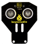
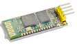
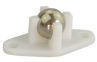
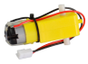
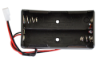
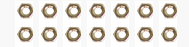
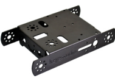
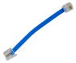
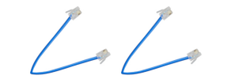

# 1. Product Introduction

## 1.1 Description

In the near future, many things might no longer be done by ourselves because the robots are able to help us do many things. So what does the future robot look like? What can it do?

He may be controlled by human voice. Do not use the remote control. Just press the power button and the robot will start do something you said and never get tired.

In addition to cooking, there may be another magical feature. In the summer, the weather is very hot. At this time, you definitely want to drink a glass of juice. As long as you give orders, the robot will pick up the fruit and put it in his body. After a while, there will be juice to drink, and he can freeze the juice. The taste is more delicious. Robots also have a lot of magical features that allow you to enjoy a simple, fast lifestyle, and the future robots will become more excellent.

Now, let’s DIY the KEYBOT robot. The KEYBOT robot is based on easy-to-use and flexible open-source Arduino platform. KEYBOT control board comes with the RJ11 plug, so it is very easy to connect other sensor modules with only one cable.

The robot is designed in metal structure, solid and durable. The assembly is really simple, believing you can install well the KEYBOT within 30mins.

As for the KEYBOT coding, you will learn how to get started with Arduino programming C language and Mixly block platform. Even the beginner with no coding experience can easily understand the graphical program. Take your brain on an inspiring journey through the world of programming. Get started now!

## 1.2 Parameters

- External power supply range: 7-12V

- Current Range: min 800mA

- Motor Speed: 6.0V 100rpm/min

- Motor control is driven by TB6612

- Three groups of line tracking modules, to detect black-white line with higher accuracy and can be used for anti-fall control as well.

- Ultrasonic module is used to detect the obstacle distance, avoiding the front obstacle when the distance detected is less than a certain value.

- Bluetooth wireless module can be paired with Bluetooth device on mobile phone to remotely control the KEYBOT. Turn off the Bluetooth when programming.

- The shield has two servo interfaces.

- It can access the external voltage 7\~12V.

## 1.3 List

You can see a pretty beautiful packaging box for the KEYBOT, and inside the KEYBOT packaging you will find all the parts and screws listed below.

| No.  |                          Components                          | QTY  |                           Picture                            |
| :--: | :----------------------------------------------------------: | :--: | :----------------------------------------------------------: |
|  1   |                     KEYBOT Control Board                     |  1   |  |
|  2   |          Top Acrylic Panel for KEYBOT control board          |  1   |  |
|  3   |                   KEYBOT Ultrasonic Sensor                   |  1   |  |
|  4   |                 KEYBOT Line Tracking Sensor                  |  1   |  |
|  5   |             Keyestudio Bluetooth Module-(HC-06)              |  1   |  |
|  6   |                  W420 steel universal wheel                  |  1   |  |
|  7   | single shaft gear motor with 2.54-socket  KF2510-2P red-black lead 200mm Right motor |  1   |  |
|  8   | single shaft gear motor with 2.54-socket KF2510-2P red-black lead 140mm Left motor |  1   |  |
|  9   |                 18650 2-cell Battery Holder                  |  1   |  |
|  10  |                    6-cell AA Battery Case                    |  1   |  |
|  11  |                 black-white 6515 robot wheel                 |  2   |  |
|  12  |                Dual-pass M3*40 copper pillar                 |  4   |  |
|  13  |           Single-pass M3*15+6MM hex copper pillar            |  4   |  |
|  14  |                   M3*30MM round-head screw                   |  4   |  |
|  15  |                    M3*8MM flat-head screw                    |  4   |  |
|  16  |             M3*8 stainless steel inner hex screw             |  10  |  |
|  17  |           M3*10MM stainless steel inner hex screw            |  10  |  |
|  18  |                     M3 Nickel plated nut                     |  14  |  |
|  19  |                   KEYBOT body black holder                   |  1   |  |
|  20  |       Yellow-black handle 3*40MM Phillips Screwdriver        |  1   |  |
|  21  |              EASY plug white Piranha LED module              |  1   |  |
|  22  |                     6P6C RJ11 cable 10CM                     |  1   |  |
|  23  |                     6P6C RJ11 cable 20CM                     |  2   |  |
|  24  |            Type-L M2.5 Nickel plated Allen wrench            |  1   |  |
|  25  |                          USB cable                           |  1   |  |

## 1.4 Core Part of KEYBOT

The core is the part that really matters today. In fact, it is very easy to understand the core. In other word, the core is just like the human brain. It can receive various kinds of information every day and will send out various instructions every day.

The core part of our robot is a control board specially designed for KEYBOT. It integrates both ARDUINO and motor driver, so the use method of this integrated board is the same as the ARDUINO controller.

Well, let's first look at what every element and interface of the board does:

