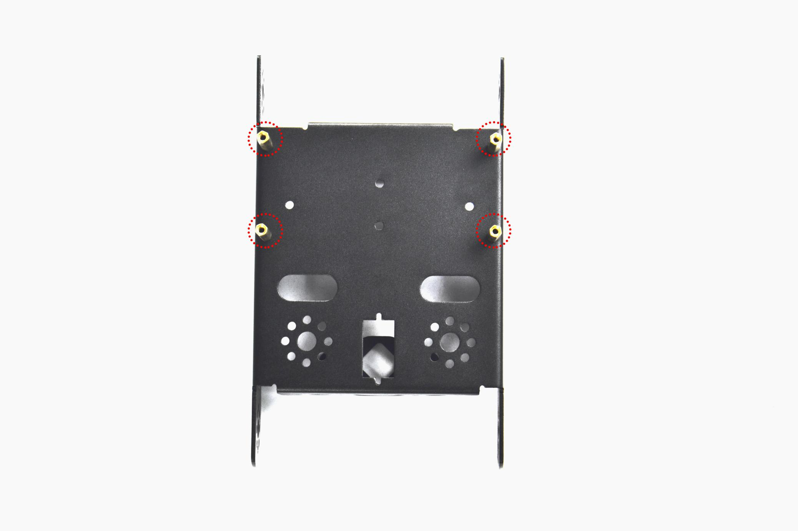
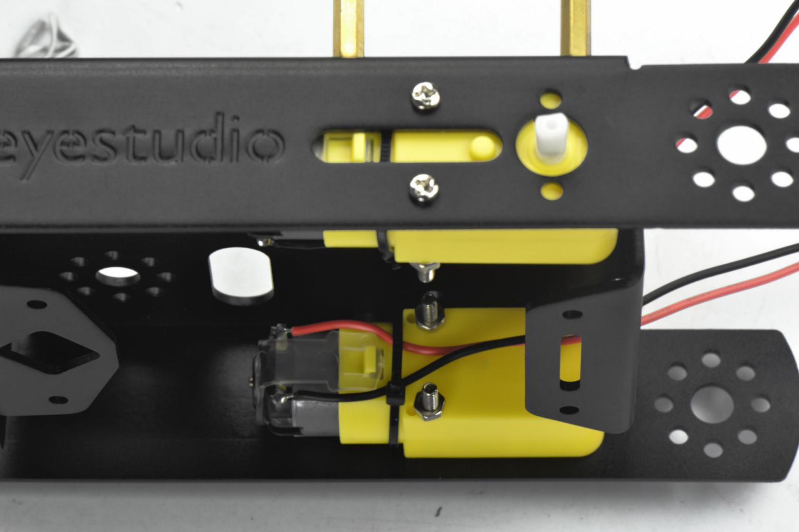
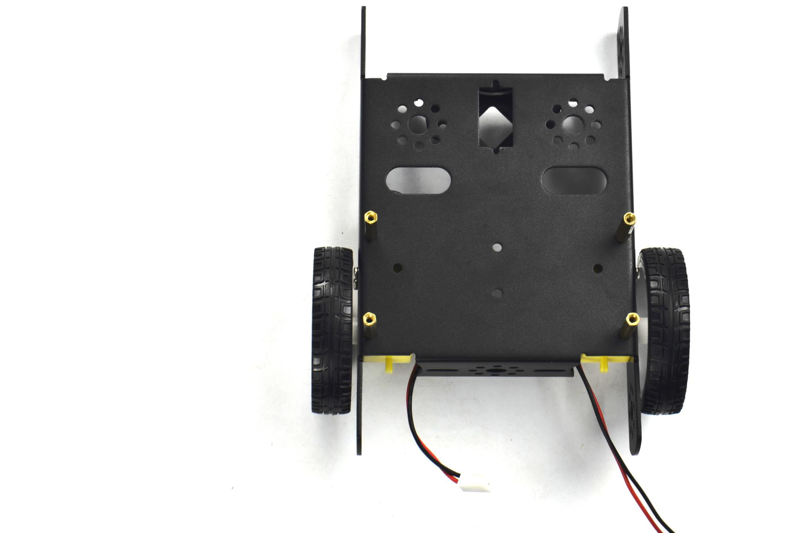
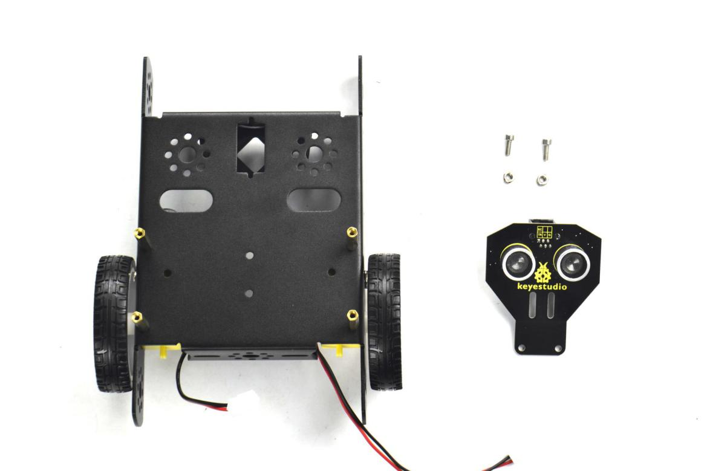
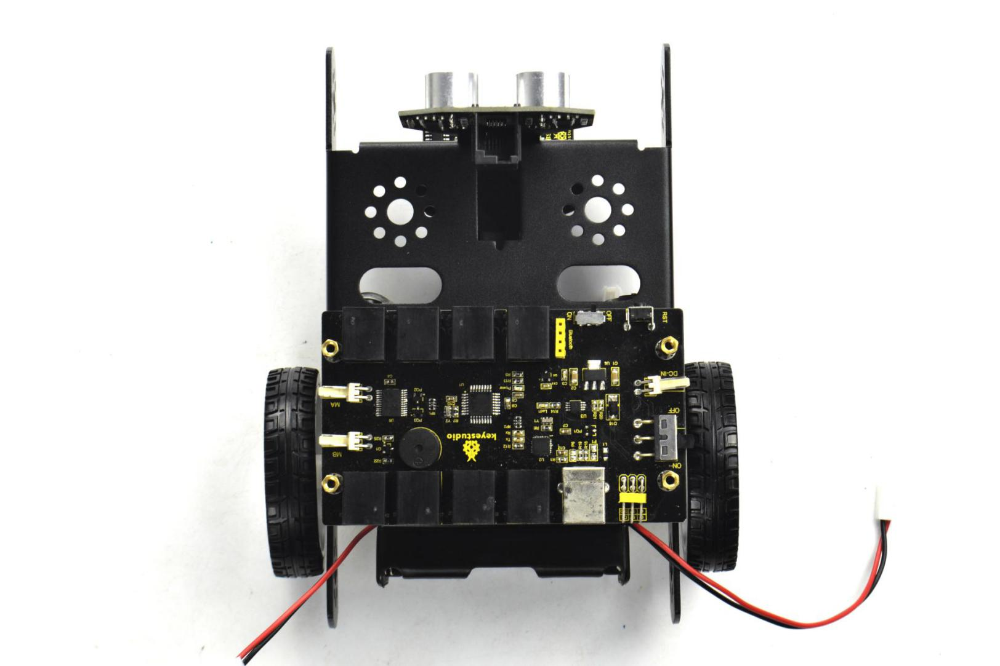
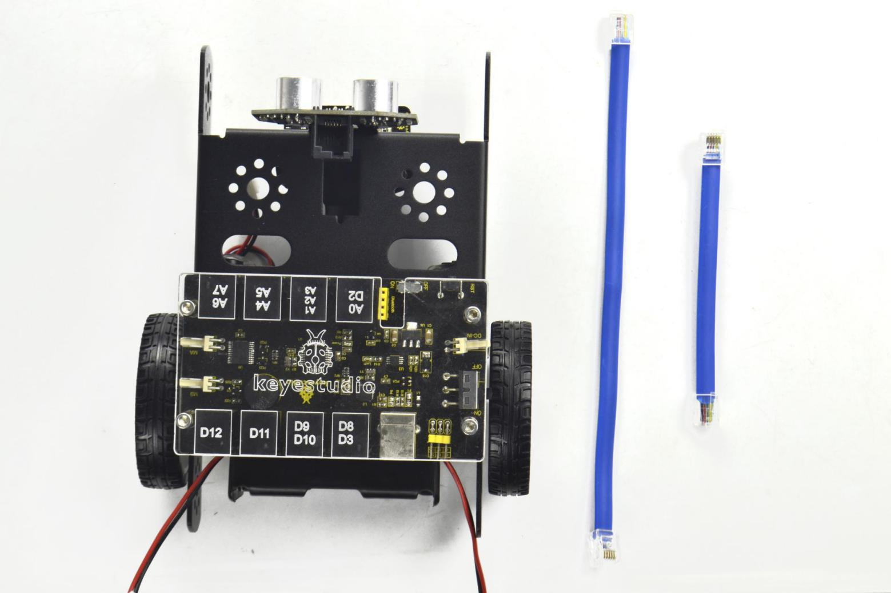
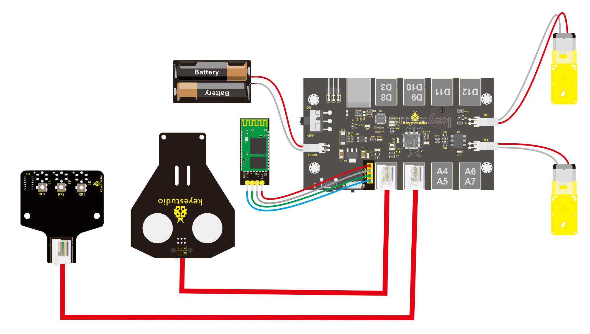

# 2. Product installation

Follow the assembly steps below to build your own robot, believe you will be full of delight to experience the robot DIY. If still confused, you are able to see the assembly video.

Begin with the KEYBOT body part. Firstly, you should prepare the components as follows:

- Keyestudio KEYBOT body holder \*1
- M3\*8 stainless steel inner hex screw \*4
- M3\*40mm double-pass copper pillar \*4

Then, fix the four M3\*8 screws and four M3\*40mm copper pillars on the KEYBOT body holder.

Install the motors for the robot, and prepare the components as follows:

-  Gear motor \*2

-  M3\*30MM round-head screw \*4

-  M3 Nickel plated nut \*4

Firstly, place the KEYBOT body holder as below. Mount the gear motor with short lead on the left of holder, and mount another motor with longer lead on the right of holder.

Completed the above assembly, let's install the wheels for the KEYBOT.

- 6515 wheel \*2

Mount the two 6515 wheels into the two gear motors.

Now you should install the particular eye for the robot, i.e. Ultrasonic module. You should prepare the components as follows:

- M3\*8 stainless steel hex screw \*2

- M3 Nickel plated nut \*2

- Ultrasonic Sensor*1

    

Mount the Ultrasonic sensor on the KEYBOT body holder using two M3\*8 screws and two M3 Nuts.

In the following section, assemble the line tracking sensor and W420 steel ball wheel.

-  M3\*10MM stainless steel hex screw \*2

-  M3 Nickel plated nut \*2

-  Line tracking sensor \*1

-  W420 steel universal wheel \*1

Firstly mount the line tracking sensor on the bottom of KEYBOT body holder with two M3\*10 screws.

Then fix the W420 wheel to the line tracking sensor with two M3 Nuts, as shown below.

Fix the battery case on the KEYBOT body holder. Here you can choose the18650 2-cell battery case or 6-cell AA battery case. The assembly method for 18650 2-cell battery case as below.

-  M3\*8MM flat-head screw \*2

-  M3 Nickel plated nut \*2

-  18650 2-cell battery case \*1

Mount the 2-cell battery case on the back of KEYBOT body holder with two M3\*8MM flat-head screws and two M3 Nuts.

If you would like to install the 6-cell AA battery case, you can refer to below.

-   6-cell AA battery case \*1

Here we install the 18650 2-cell battery case for the KEYBOT. So we will take the KEYBOT installed with 18650 battery case as example to start the following project sections.

-  Completed the above assembly, then fix the KEYBOT control board on the robot body holder.

-   M3\*15+6MM single-pass copper pillar \*4

-   KEYBOT control board \*1

Mount the KEYBOT control board on the top of KEYBOT body holder with four M3\*25+5MM single-pass copper pillars.

Next step is to install the Acrylic top panel on the control board.

-  M3\*10MM stainless steel hex screw \*4

-  Acrylic top panel \*1

Mount the Acrylic top panel onto the control board with four M3\*10MM screws.

Till now, the robot parts are installed well. Final step is to connect the wire.

-  6P6C RJ11 cable 10CM \*1

-  6P6C RJ11 cable 20CM \*1

**Hookup Guide:**

1. Connect the both ultrasonic sensor and line tracking sensor to KETBOT control board.

2. Connect the ultrasonic sensor to the connector A0-D2 using the RJ11 cable 10cm.

3. Connect the line tracking sensor to the connector A1-A2-A3 using the RJ11 cable 20cm.

4. Connect the motor with short lead to MA, and connect another motor with longer lead to MB.

5. The battery case is connected to the DC-IN connector of control board.

Finally, plug the **HC-06 Bluetooth module** into the control board. (Note: please first program the module as the Bluetooth project mentioned below, then plug it into the board.)

Congratulations! You have completed the KEYBOT robot installation.

